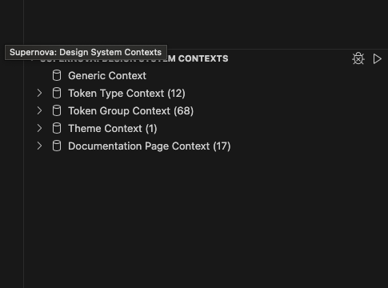

# Sev Desk Supernova Flutter Exporter

As the default [flutter exporter] does not properly allow for themes,
this exporter fixes this issue as well as preparing custom export formats easily.

To properly use the [supernova] data, the supernova sdk was used.

The `./src/index.ts` takes care of fetching the data and applying the templates.
It hands over data processing to the specialized handlers in `./src/content/`.
To handle all references, `./src/content/util.ts` exposes a reference helper.
A specialized handler takes care of extracting the relevant information from
the supernova tokens and mapping them to the template data.
This way, all files written can be controlled in `./src/index.ts`.

For templating, the [eta.js] engine was used.

## Exporter Features

Here are the key features of this exporter:

- `primitive` themeless color export as static members with support for shades
- `semantic` themed color scheme as a theme extension
- `shadows` exported as box shadows
- easy constant export template, that powered e.g.
`line_height`, `font_size`, `letter_spacings`
- `typogrpahy` exported as theme extension

## Example of Theme Extension Output

This is a shortened version of the generated `primitives_colors.dart` output.

```dart
'package:flutter/material.dart';
import 'package:sev_design_tokens/src/colors/primitive_colors.dart';

/* This file was generated by Supernova, don't change by hand */
@immutable
class OffenburgColorScheme extends ThemeExtension<OffenburgColorScheme> {
  const OffenburgColorScheme({
    required this.brandVibrantRed,
    // more fields here
  });

  factory OffenburgColorScheme.light() => OffenburgColorScheme(
    brandVibrantRed: ColorPrimitives.colorVibrantRed.shade90,
    // more fields here
  )

  final Color brandVibrantRed;
  // more fields here


  @override
  ThemeExtension<OffenburgColorScheme> copyWith({
    Color? brandVibrantRed,
    // more fields here
  }) {
    return OffenburgColorScheme(
      brandVibrantRed: brandVibrantRed ?? this.brandVibrantRed,
    // more fields here
    );
  }


  @override
  ThemeExtension<OffenburgColorScheme> lerp(
    OffenburgColorScheme? other,
    double t,
  ) {
    if (other is! OffenburgColorScheme) {
      return this;
    }
    return OffenburgColorScheme(
      brandVibrantRed: Color.lerp(
        brandVibrantRed,
        other.brandVibrantRed,
        t,
      )!,
      // more fields here
    )
  }

  static OffenburgColorScheme of(BuildContext context) =>
      Theme.of(context).extension<OffenburgColorScheme>()!;
}
```

## Configuration Options

Actually non yet, but this is here for reference if we decide to add them

- **generateDisclaimer:** Toggle to show a disclaimer indicating the file is auto-generated.

## Running it locally

To run this project locally, you have two options:
- supernova cli
- vscode plugin

In both cases, get access to the supernova token first. For generation of these, look at [supernova tokens].

First make sure, you have the latest changes by running
```sh
npm run build
# or start it in watch mdoe
npm run dev
```
to update the `./dist/build.js` with your latest changes.

### Supernova CLI

Make sure, the `$SUPERNOVA_TOKEN` is available and valid. Now you can run
```sh
npm run local -- --apiKey=$SUPERNOVA_TOKEN
# or if you want to fully customise the command
npx supernova run-local-exporter --designSystemId=103465 --exporterDir=. --outputDir=export --apiKey=$SUPERNOVA_TOKEN --allowOverridingOutput
```

You can find the output in the `./export` folder locally.

### VSCode Plugin

Run `Supernova: Supernova Log In`, enter the token when asked, all the other options can be default values.

Afterwards, you will see the supernova context added to the explorer view.
You can now just run the latest local build by pressing the play button.


[supernova]: https://www.supernova.io
[supernova sdk]: https://developers.supernova.io/latest/
[supernova tokens]: https://cloud.supernova.io/user-profile/authentication
[supernova cli]: https://www.npmjs.com/package/@supernovaio/cli
[supernova VSCode Plugin]: https://marketplace.visualstudio.com/items?itemName=SupernovaIO.pulsar-vsc-extension
[flutter exporter]: https://github.com/Supernova-Studio/exporter-flutter
[eta.js]: https://eta.js.org